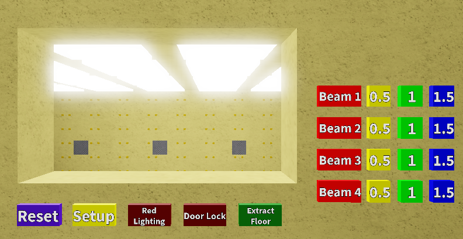
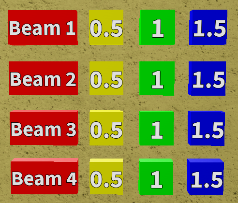

Control Panel
=============

Screenshot taken on 30/7/2019.

Buttons
=======

.. contents:: Contents
    :depth: 2
    :local:

Bottom Row
----------

These buttons control the room directly.
The buttons in this row are documented in the order from left to right.

Reset
^^^^^

.. warning:: |notYetImplemented|

Resets the whole room.

.. _setup:

Setup
^^^^^

Sets up the room for a round.
This will initiate the start of round sequence.

.. todo::

    Further elaborate

Red Lighting
^^^^^^^^^^^^

Makes the red lights flash.
When turned on, the lights will keep on flashing until they are turned off.
The flashing is disabled by default.
The colour of the button determines its state.

.. csv-table:: Colours and States
    :header: "Colour", "State"
    :widths: 20, 60

    "Brown", "Off (Default)"
    "Green", "On"

Door Lock
^^^^^^^^^

.. warning:: |notYetImplemented|

Locks the door.

Extract Floor
^^^^^^^^^^^^^

Closes the floor if it is open.
This is used if a round is cleared.

.. note::

    This can only be used when the floor is opened.
    To open the floor, click on the :ref:`setup` button.

Beam Controls
-------------

These buttons control the movement of the beams.

.. note::

    The room must be set up before these buttons are usable.
    To set up the room, click on the :ref:`setup` button.

Movement
^^^^^^^^

The first column buttons (Beam 1, Beam 2, Beam 3 and Beam 4) control whether
or not the beams are moving.
All beams are not moving by default.
Clicking on these buttons toggles the movement of the respective beams.
The colour of the button determine the state of a beam.

.. csv-table:: Colours and States
    :header: "Colour", "State"
    :widths: 20, 60

    "Red", "Not moving (Default)"
    "Green", "Moving"

Speed
^^^^^

The second to fourth columns buttons (0.5, 1 and 1.5) control the speed of
the beam when it is moving.
Clicking on the button will change the speed for the beam on the same row
as it.
The default speed for every beam is 1.

.. note::

    These buttons can still work when the beam is moving.
    If so, the speed of the moving beam will change immediately.

The speed is represented in the unit of studs per 20 seconds
at the time of writing.
The table below shows the details for the theoretical speed and time.

+--------------------+--------------------+-------------------------------------------+
| Nominal speed      | Speed              | Time taken                                |
| (Shown on button)  | (studs per second) +--------------------+----------------------+
|                    |                    | 1 stud             | Whole beam           |
|                    |                    |                    | (15 studs)           |
+--------------------+--------------------+--------------------+----------------------+
| 0.5                | 0.025              | 40 seconds         | 10 minutes           |
+--------------------+--------------------+--------------------+----------------------+
| 1 (Default)        | 0.05               | 20 seconds         | 5 minutes            |
+--------------------+--------------------+--------------------+----------------------+
| 1.5                | 0.075              | 13.33 seconds      | 3 minutes 20 seconds |
+--------------------+--------------------+--------------------+----------------------+

In reality, the time taken by the beam to move will always be slightly longer.
This means the beam moves slightly slower than expected.
From tests done in studio at the time of writing, it will take around
1.067 seconds on average when it is supposed to take exactly 1 second.
